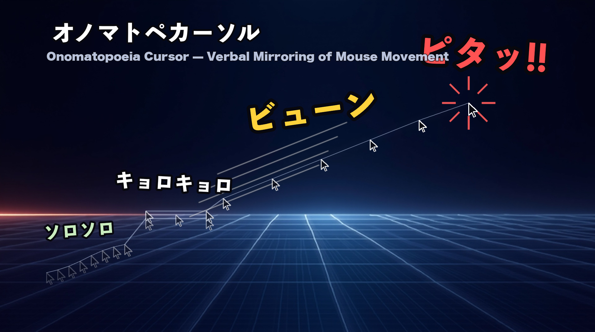
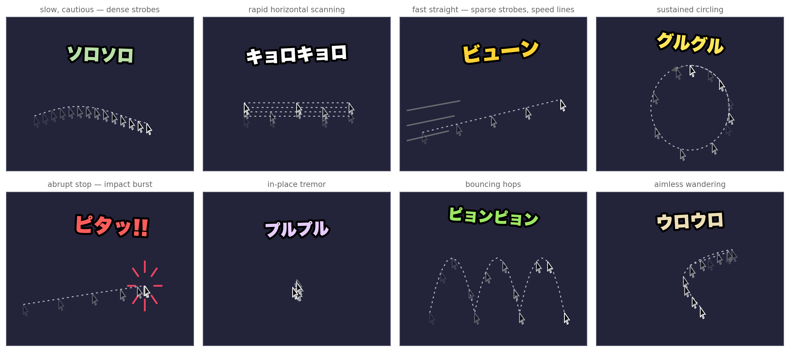
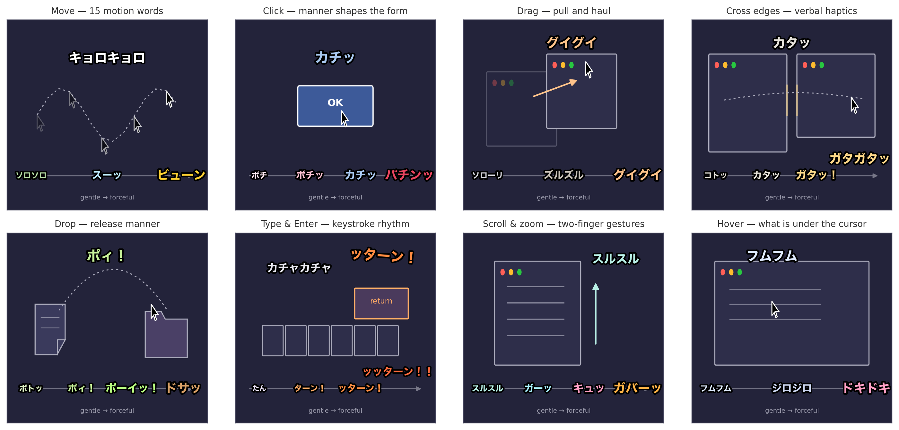
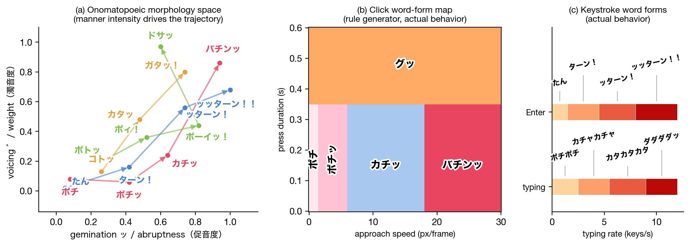

<p align="center"><a href="README.md">日本語</a> | <a href="README.en.md">English</a> | <a href="README.zh.md">中文</a> | <a href="README.ko.md">한국어</a> | Français</p>

<div align="center">

# 👀 OnomatopeCursor

**Votre curseur commente vos gestes en onomatopées.**
*Your cursor narrates how you move — in manga sound words.*


[](https://github.com/ochyai/OnomatopeCursor/releases/latest)
[](https://doi.org/10.5281/zenodo.21712979)
[](LICENSE)


</div>

Depuis un demi-siècle, le curseur ne sait dire qu'une chose : **où** il pointe. Pourtant nos mains hésitent, s'emballent, tournent en rond — un geste a toujours une **texture**. OnomatopeCursor est une application macOS qui lit cette texture en temps réel et la commente au-dessus du curseur, en onomatopées lettrées à la main comme dans une planche de BD.

Bougez tout doucement : **tout douuux** (ソロソロ). Lancez la main : **ZIOUUUM !** (ビューン). Arrêtez-vous net et un **PILE !!** (ピタッ!!) rouge s'écrase sur l'écran. Un clic effleuré donne **tip** (ポチ), un clic appuyé **CLAC !!** (バチンッ). Balancez un fichier et c'est **HOOOP !** (ポーイッ！). Et si vous ne touchez plus à rien pendant cinq secondes, le curseur se met à ronfler : **roon… pchh…** (すぅすぅ).

Le vocabulaire ne se choisit pas : c'est **le miroir de votre corps**. À l'usage s'installe une étrange inversion de causalité — « j'ai l'impression de m'être arrêté parce que ça a dit PILE !! ». C'est justement le sujet de recherche du projet ([voir l'article](#-article--paper)).

<div align="center">



</div>

## ⚡ Démarrer en une minute

1. **[Téléchargez la dernière version](https://github.com/ochyai/OnomatopeCursor/releases/latest)** (notarisée par Apple, gratuite)
2. Ouvrez le zip et glissez `OnomatopeCursor.app` dans le dossier Applications
3. Lancez l'app : dès que le 👀 apparaît dans la barre de menus, il n'y a plus qu'à bouger la souris

Aucun réglage ni aucune autorisation supplémentaire (seuls les canaux étendus, clavier et compagnie, demandent la permission décrite plus bas).

## 🖱 Le geste devient parole — 15 mots de mouvement

À 60 Hz, l'app lit la vitesse, le jerk, les changements de direction, la rotation et la rectitude du curseur, puis classe la qualité du geste en 15 mots.

<div align="center">



</div>

| Votre geste | Le mot |
|---|---|
| Lent et prudent | **tout douuux** (ソロソロ) — au ralenti extrême, **raaampe…** (ジリジリ) |
| Fluide, tout en glissé | **gliiiss** (スーッ), et **zioup zioup** (スイスイ) dans les courbes |
| Rapide et droit | **ZIOUUUM !** (ビューン) — plus heurté, **TAGADA !** (ダダダッ) |
| Ça balaye de gauche à droite | **zieut zieut** (キョロキョロ), et **VOUM VOUM !** (ブンブン) si ça s'emballe |
| Ça sautille de haut en bas | **hop hop !** (ピョンピョン) |
| Ça tourne en rond | **tournicoti** (グルグル), et **frrt frrt** (クルクル) pour les petits cercles |
| Errance sans but | **vadrouille** (ウロウロ) |
| Geste désordonné, panique | **houlà houlà** (オロオロ) |
| Tremblement sur place | **brr brr** (プルプル) |
| Arrêt net à pleine vitesse | **PILE !!** (ピタッ!!) — avec effet d'impact |

## 🎚 La qualité du geste déforme le mot — morphologie du symbolisme sonore

Le cœur de l'app n'est pas « un événement → un mot fixe » mais « **une qualité de geste → une forme de mot** ». Le symbolisme sonore japonais — **sonorisation = poids, consonne géminée = netteté, allongement vocalique = durée, redoublement = répétition** — est paramétré en continu, et la BD francophone offre exactement les mêmes leviers : initiales sourdes légères contre initiales lourdes B/V/GR, durcissement des groupes consonantiques, voyelles étirées à l'écrit, formes redoublées. Un même clic ne s'écrit donc pas pareil selon la force appliquée.

<div align="center">



</div>

- Selon la force du clic : **tip → tic ! → CLIC ! → CLAC !!** (ポチ → ポチッ → カチッ → バチンッ)
- Selon l'élan du dépôt : posé délicatement **plop** (ポトッ), balancé **HOOOP !** (ポーイッ！), porté longtemps puis lâché d'un bloc **BOUM !** (ドサッ)
- Selon l'énergie de la touche Entrée : **tac → TAC ! → VLAN ! → VLAAAN !!** (たん → ターン！ → ッターン！ → ッッターン！！)
- Selon la vitesse de frappe : **tip… tap… → tacatac → tacatacatac → RATATATA !** (ポチポチ → カチャカチャ → カタカタカタ → ダダダダッ)

## 🤖 Mode génératif — des onomatopées inédites, créées à la volée

Activez « Mode génératif » dans le menu : l'app cesse de puiser dans un dictionnaire et **un petit transformeur embarqué (OnomaFormer, 0,4 M de paramètres, environ 10 ms par mot) synthétise sur place un mot neuf à partir de la qualité du geste**. Entraîné sur 2 782 onomatopées japonaises, il est conditionné par 4 dimensions de forme et 6 dimensions de sens (impact, mouvement, texture, affect, lumière, humidité) : un même geste accouche à chaque fois d'un mot légèrement différent, tout juste né.

<div align="center">



</div>

Une réserve, toutefois : **quand la source sonore est évidente, la famille du mot est verrouillée**. La frappe reste dans la famille tacatac, la touche Entrée dans la famille TAC / VLAN. La liberté du modèle ne s'exerce qu'à l'intérieur de la famille — c'est ce qui préserve la sensation d'être justement décrit.

## ✍️ Lettrage BD

Les caractères ne sortent pas tels quels de la police. Chaque glyphe est vectorisé puis retravaillé : **tremblement dessiné à la main (boil à 8 fps)**, **pression du trait, attaques et sorties de plume, réserves sèches**, et une animation propre à chaque mot (l'atterrissage écrasé de **PILE !!**, la rotation de **tournicoti**, les battements de **poum poum**…). Les mots forts arrivent gros, rouges, avec une ombre profonde ; les mots discrets restent petits et pâles — le poids devient directement visible.

- La taille des lettres varie de 0,8× à 1,9× selon l'intensité du geste
- Lignes de vitesse pour **ZIOUUUM !** et **TAGADA !**, éclats de burst pour les mots d'impact
- Le style de lettrage est amélioré en continu par une **boucle d'exploration esthétique** (rendu → évaluation par un modèle vision-langage → régression)
- Si l'écran devient trop chargé : **Affichage → Style haute lisibilité (texte blanc + ombre)**. Les effets eux-mêmes peuvent aussi être coupés

## ⌨️ Au-delà du curseur — 7 canaux d'entrée

| Canal | Les mots | Autorisation requise |
|---|---|---|
| Mouvement du curseur | les 15 mots ci-dessus + mots générés | aucune |
| Clic, appui long, clic droit (mode physique) | tic ! / gnnn… / DROICLIC ! (ポチッ／グッ／ミギクリッ！) | aucune |
| Glisser-déposer (mode physique) | oh hisse !, scrrr scrrr → hop ! (グイグイ・ズルズル → ポィ！) | aucune |
| Franchir le bord d'une fenêtre (mode physique) | **toc !** (カタッ), et **CHTOC CHTOC** (ガタガタッ) en rafale — un relief tactile apparaît sur l'écran plat | aucune |
| Défilement (mode trackpad) | gliss gliss, VRRRR !, froufrou (スルスル・ガーッ・シュルシュル) | Accessibilité |
| Frappe et touche Entrée (mode clavier) | tacatac, **VLAN !** (カタカタ・ッターン！) — le texte s'affiche à la position du curseur d'insertion | Accessibilité※ |
| Immobilité | roon… pchh…, zzz… hop !, dans la luuune…, et parfois **SURSAUT !** (すぅすぅ・ウトウト・ぼー…・ビクビクッ) | aucune |

※ Le mode clavier n'utilise que le fait qu'une touche a été pressée. **Ni la touche concernée, ni le contenu saisi ne sont jamais lus.** Le mode contexte (fonction expérimentale qui fait apparaître hum hum / zieuuute… / poum poum selon l'élément sous le curseur) est lui aussi soumis à l'autorisation Accessibilité.

## 🌏 Cinq langues

日本語, English, 中文, 한국어, Français. Il ne s'agit pas d'une traduction : chaque langue est **reconçue avec sa propre boîte à outils de symbolisme sonore** (majuscules et allongement vocalique pour l'anglais, tension consonantique et alternance vocalique pour le coréen, et pour le français les leviers de la BD : initiales lourdes, groupes consonantiques durcis, voyelles étirées, redoublements…). Changement de langue à tout moment depuis le menu.

## 🎮 Jouer

- **Encyclopédie des onomatopées** : les mots rencontrés se collectionnent. Ceux que vous n'avez pas encore croisés apparaissent en silhouette
- **Défi d'invocation** : saurez-vous faire sortir le mot demandé, rien qu'avec le geste ? Une expérience où le vocabulaire tire le corps derrière lui
- **Quiz à deux choix** : de temps en temps, l'app demande « lequel sonne le plus juste ? ». Vos réponses nourrissent l'évolution du lexique
- **Points de contribution** : ils s'accumulent avec vos retours, débloquent de nouveaux mots et les diffusent

## 🔬 Mode recherche (entièrement facultatif, sur consentement explicite)

C'est aussi un projet de recherche en IHM du Digital Nature Group de l'Université de Tsukuba.

- **Participer au partage de données** : seuls les descripteurs de mouvement, les mots affichés et vos retours partent vers le serveur de recherche, avec un identifiant anonyme (le détail est affiché à chaque activation, désactivable à tout moment)
- **Journal de recherche** : conservé uniquement sur votre Mac. Vous pouvez en inspecter le contenu vous-même avant tout envoi
- **Un mot vous semble faux ? Deux clics droits d'affilée** = « non non » (チガウチガウ). C'est un retour précieux pour la recherche

Par défaut, **aucune communication réseau ni aucun enregistrement**. Le contenu de l'écran, ce que vous tapez et ce sur quoi vous cliquez ne sont lus dans aucun mode → [PRIVACY.md](PRIVACY.md)

## 📄 Article / Paper

> **Onomatopoeia Cursor: Verbal Mirroring of Mouse Movement with Comic-Style Lettering**
> Yoichi Ochiai, Miki Okamura — *Digital Nature Group, University of Tsukuba*
>
> [**PDF**](paper/onomatope-cursor-arxiv.pdf) · [**DOI: 10.5281/zenodo.21712979**](https://doi.org/10.5281/zenodo.21712979) · arXiv (en cours d'examen)

L'article couvre l'espace de conception du miroir verbal du mouvement, la paramétrisation continue de la morphologie du symbolisme sonore, la génération embarquée, et l'hypothèse centrale : **donner des mots à son propre geste transforme le sentiment d'agentivité (sense of agency)**. Il s'agit de rendre expérimentable, sous la forme d'une application distribuable, cette inversion causale — cette postdiction — que résume la phrase « le curseur s'est arrêté parce que PILE !! est apparu ».

```bibtex
@misc{ochiai2026onomatopoeiacursor,
  author = {Ochiai, Yoichi and Okamura, Miki},
  title  = {Onomatopoeia Cursor: Verbal Mirroring of Mouse Movement
            with Comic-Style Lettering},
  year   = {2026},
  doi    = {10.5281/zenodo.21712979},
  url    = {https://doi.org/10.5281/zenodo.21712979}
}
```

## 🛠 Compiler depuis les sources

```bash
git clone https://github.com/ochyai/OnomatopeCursor.git
cd OnomatopeCursor
swift run onomatope-tests   # tests (76 au total, sans dépendance à XCTest)
./scripts/build.sh          # → dist/OnomatopeCursor-<ver>.zip
```

macOS 12+, Universal (Apple Silicon et Intel). Aucune bibliothèque tierce (AppKit + Accelerate uniquement). L'inférence d'OnomaFormer est écrite en Swift pur avec BLAS, sans coremltools ni équivalent.

## License

[MIT](LICENSE) © Yoichi Ochiai & Miki Okamura, Digital Nature Group, University of Tsukuba
